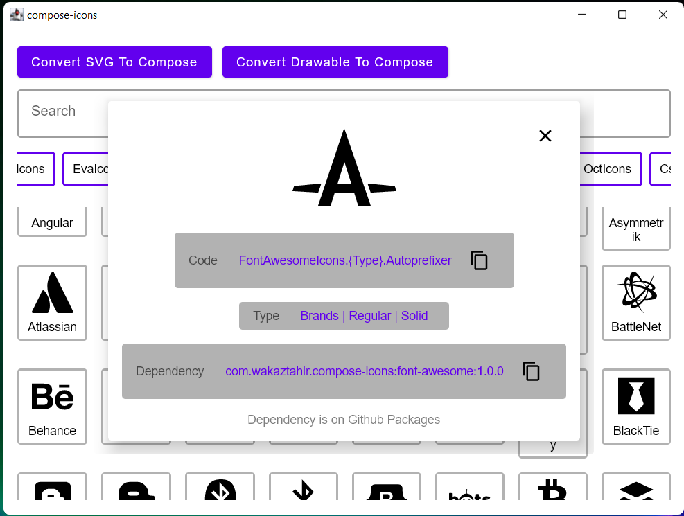
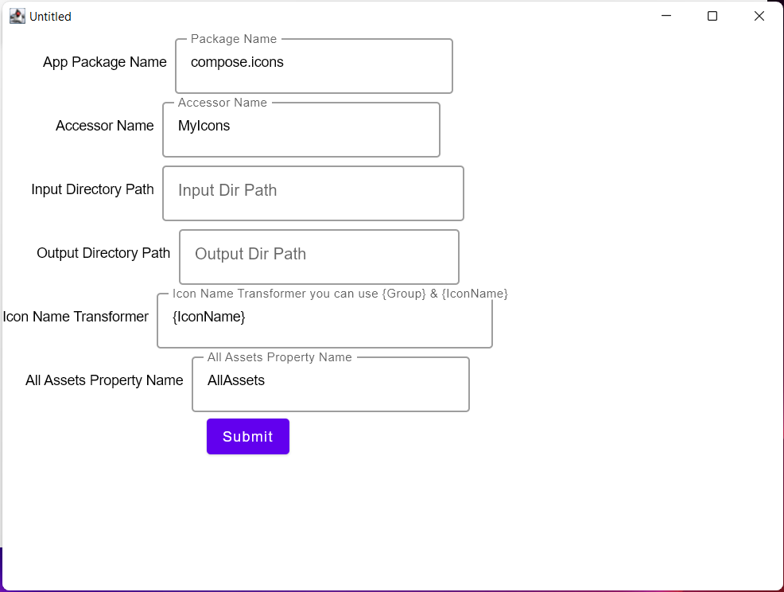

# [compose-icons](https://github.com/DevSrSouza/compose-icons)

Compose icons is a pack of libraries that provide well known Icon Packs to use in Jetpack Compose Multiplatform. The library usage is inspired by Compose Material Icons.

In the demo App you can search for icons and see how to include them


You can also convert SVGs & Drawables to Compose ImageVector 


## Compose versions

- Jetpack Compose : `1.2.2`

## Adding to your project

Add the project repository:
```kotlin
repositories {
    githubPackagesRepository() // google how to set it up , or check project's buildSrc
}
```

```kotlin
implementation("com.wakaztahir.compose-icons:ICON_PACK:1.0.0")
```

** `ICON_PACK` is a placeholder, you should replace it with your icon pack of choice.

example: `com.wakaztahir.compose-icons:simple-icons:1.0.0`

## Example

```kotlin
Icon(
    imageVector = FontAwesomeIcons.Brands.Github,
)
```

## Icon Packs


| Icon pack                                                                     | Last Updated | Dependency                  | All Icons Docs                                     |
|-------------------------------------------------------------------------------|--------------|-----------------------------|----------------------------------------------------|
| [Simple-Icons](https://simpleicons.org/)                                      | 20/01/2023   | `simple-icons`              | [docs](simple-icons/DOCUMENTATION.md)              |
| [Feather](https://feathericons.com/)                                          | 20/01/2023   | `feather`                   | [docs](feather/DOCUMENTATION.md)                   |
| [Tabler Icons](https://tabler-icons.io/)                                      | 20/01/2023   | `tabler-icons`              | [docs](tabler-icons/DOCUMENTATION.md)              |
| [Eva Icons](https://akveo.github.io/eva-icons/#/)                             | 20/01/2023   | `eva-icons`                 | [docs](eva-icons/DOCUMENTATION.md)                 |
| [Font Awesome](https://fontawesome.com/)                                      | 20/01/2023   | `font-awesome`              | [docs](font-awesome/DOCUMENTATION.md)              |
| [Weather Icons by Erik Flowers](https://github.com/erikflowers/weather-icons) | 20/01/2023   | `erikflowers-weather-icons` | [docs](erikflowers-weather-icons/DOCUMENTATION.md) |
| [Line Awesome](https://icons8.com/line-awesome)                               | 20/01/2023   | `line-awesome`              | [docs](line-awesome/DOCUMENTATION.md)              |
| [Linea](http://www.linea.io/)                                                 | 20/01/2023   | `linea`                     | [docs](linea/DOCUMENTATION.md)                     |
| [Octicons](https://primer.style/octicons/)                                    | 20/01/2023   | `octicons`                  | [docs](octicons/DOCUMENTATION.md)                  |
| [css.gg](https://css.gg/)                                                     | 20/01/2023   | `css-gg`                    | [docs](css-gg/DOCUMENTATION.md)                    |
| [MaterialDesignIcons](https://materialdesignicons.com/)                       | 20/01/2023   | `materialdesignicons`       | [docs](materialdesignicons/DOCUMENTATION.md)       |
| [Phosphor Icons](https://materialdesignicons.com/)                            | 20/01/2023   | `phosphor-icons`            | [docs](phosphor-icons/DOCUMENTATION.md)            |
| [Remix Icons](https://materialdesignicons.com/)                               | 20/01/2023   | `remix-icons`               | [docs](remix-icons/DOCUMENTATION.md)               |
| [Ion Icons](https://materialdesignicons.com/)                                 | 20/01/2023   | `ion-icons`                 | [docs](ion-icons/DOCUMENTATION.md)                 |
| [Fluent UI System Icons](https://materialdesignicons.com/)                    | 20/01/2023   | `fluentui-system-icons`     | [docs](fluentui-system-icons/DOCUMENTATION.md)     |
| [Studio Icons](https://materialdesignicons.com/)                              | 20/01/2023   | `studio-icons`              | [docs](studio-icons/DOCUMENTATION.md)              |

## How the project works

The project uses Kotlin Scripting (main.kts) to download and generate the icons into Compose source code, to generate the source code it uses the tooling library [svg-to-compose](https://github.com/DevSrSouza/svg-to-compose).

Currently, the Jetpack Compose(Android) and Jetbrains Compose (Desktop/Multiplatform) are a separated artifact and builds, this means that for the library to support both is need artifacts for both.

In the future, when Compose Desktop and Android use the same artifact, the project will migrate to it and use only one artifact for both.

## Contribution

If you know a icon pack that the project could support, please, submit an issue :D

## License

The icon packs have their own license that you can find at the [All Icons Docs](#Icon-Packs)

Project license:
```
MIT License

Copyright (c) 2021 DevSrSouza

Permission is hereby granted, free of charge, to any person obtaining a copy
of this software and associated documentation files (the "Software"), to deal
in the Software without restriction, including without limitation the rights
to use, copy, modify, merge, publish, distribute, sublicense, and/or sell
copies of the Software, and to permit persons to whom the Software is
furnished to do so, subject to the following conditions:

The above copyright notice and this permission notice shall be included in all
copies or substantial portions of the Software.

THE SOFTWARE IS PROVIDED "AS IS", WITHOUT WARRANTY OF ANY KIND, EXPRESS OR
IMPLIED, INCLUDING BUT NOT LIMITED TO THE WARRANTIES OF MERCHANTABILITY,
FITNESS FOR A PARTICULAR PURPOSE AND NONINFRINGEMENT. IN NO EVENT SHALL THE
AUTHORS OR COPYRIGHT HOLDERS BE LIABLE FOR ANY CLAIM, DAMAGES OR OTHER
LIABILITY, WHETHER IN AN ACTION OF CONTRACT, TORT OR OTHERWISE, ARISING FROM,
OUT OF OR IN CONNECTION WITH THE SOFTWARE OR THE USE OR OTHER DEALINGS IN THE
SOFTWARE.

```
